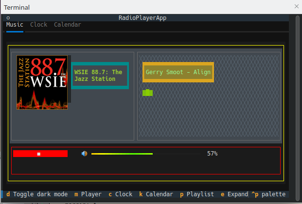
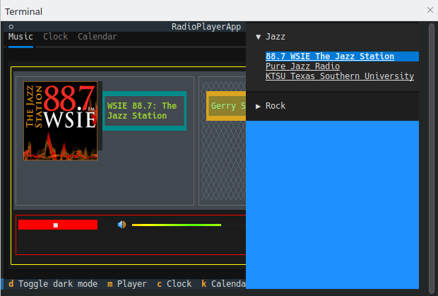

# AudioPlayer


## A textual.app for playing online radio streams
The app was actually developed for the Raspberry Pi to provide a simple but attractive interface for a Raspi LCD display.
However, the app works in principle on all Linux distributions that meet the following requirements:

* a terminal which supports Rich Python library
* can run a VLC-Player
* uses ALSA soundsystem (also pipewire with ALSA)

## Installation
you can install the app with ```pip install tui_audioplayer```  
`pipx` will not work :-(

You can also clone the repository  
go into te *src* folder and run ```python3 -m tui_audioplayer.radioplayer```

## Playlist
The Playlist is the [JSON](https://www.xspf.org/jspf) version off XSPF. 

Each Category has its own folder in the *Playlist* folder.
You can create categories as you like.

Every category folder contains a playlist file (.jspf). The playlist file has the same name in lower case as the category e.g.:
category *Jazz* playlist file name *jazz.jspf*.

The playlist entries -the radio stations- are organized in *tracks* as followed:

* **location**: the url (in []) where the music comes from
* **title**: the radio station name
* **image**: the file name for the image of the radio station. The image is a 400x400 *png* in the same folder of the playlist. Please avoid spaces in file names.
 
To open and close the Playlist press the *p* key



